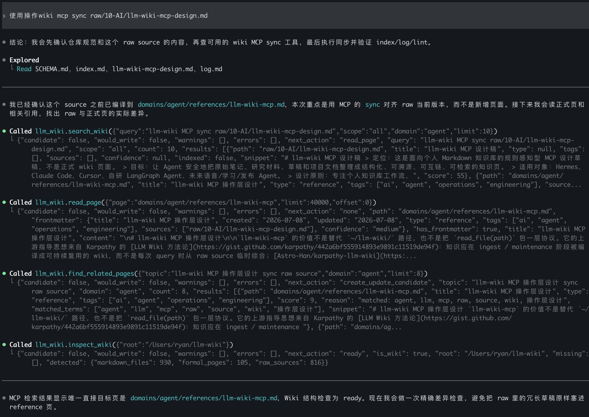

# llm-wiki-mcp

[English](README.md) | [**中文**](README.zh-CN.md)


An MCP server that gives your AI agents a governed wiki instead of unrestricted filesystem access. It sits between "full power" and "read-only" by requiring human approval before any formal wiki page gets updated.

> Design philosophy draws from [Karpathy's LLM Wiki methodology](https://gist.github.com/karpathy/442a6bf555914893e9891c11519de94f): compile knowledge into a reusable wiki during ingest/maintenance, rather than re-synthesizing from raw sources on every query. [Astro-Han/karpathy-llm-wiki](https://github.com/Astro-Han/karpathy-llm-wiki) and [multica-ai/andrej-karpathy-skills](https://github.com/multica-ai/andrej-karpathy-skills) served as engineering references.

The project started by hand-crafting `~/llm-wiki` to validate the workflow, then abstracting it into an MCP server — the tool design comes from real usage, not theory.

---

## Why this exists

When you use an AI agent to build a knowledge base, it can read and write pages. Without constraints:

- It overwrites pages you spent time curating.
- Files end up scattered across directories with no consistent structure.
- It updates `index.md` without recording what changed.
- There's no audit trail of who changed what and why.

This server forces every write to go through a candidate review cycle. The agent proposes changes, you review and approve them, and only then does the wiki update.

---

## What it does

- **Candidate-first writes** — formal pages, index updates, and public exports are proposals. Nothing gets written until you call `apply_candidate`.
- **Immutable raw sources** — `raw/` files can only be created, never overwritten. Your source material stays intact.
- **Path safety** — all operations stay within `wiki_root`. Parent-traversal attempts are rejected at the path layer.
- **Structured linting** — `run_lint` returns parsed results (errors, warnings, suggestions) as data, not a process exit code that breaks the MCP transport.
- **Change log** — every mutation is logged with action, impact, and verification, with configurable retention.
- **Search that tells you what to do next** — formal pages and raw sources are ranked separately. Scope-aware search returns a `next_action` hint (`read_page` vs `read_raw_source`).
- **Frontmatter validation** — unknown fields, empty directory lists, and invalid retention values are caught before they reach your wiki.

---

## Workflow



```text
New / revised source added
        ↓
compile_page or create_update_candidate
        ↓
Review Candidate bundle (page, index, public-draft, log, source-manifest)
        ↓
apply_candidate after explicit approval
        ↓
run_lint
```

Agents return persisted **Candidate bundles** first. You (or your agent's human-in-the-loop) review the full change set before anything touches the formal wiki.

---

## Quick Start

```bash
git clone https://github.com/jaronlu/llm-wiki-mcp.git
cd llm-wiki-mcp
uv sync --dev
cp config/examples.config.yaml config/config.yaml
uv run llm-wiki-mcp
```

Edit `config/config.yaml` for your machine. Keep it local and untracked.

```yaml
wiki_root: ~/llm-wiki
allow_write_raw: false
allow_write_formal: false
allow_update_index: false
allow_modify_schema: false
log_retention_entries: 120
formal_dirs: [domains, entities]
raw_dirs: [raw]
non_formal_dirs: [drafts, reading]
```

---

## MCP tools

| Tool | What it does |
|------|-------------|
| `init_wiki` | Creates or completes a wiki root with scaffolding |
| `inspect_wiki` | Checks if a directory is a valid wiki and reports status |
| `search_wiki` | Scope-aware search across formal pages and raw sources |
| `read_page` | Reads a formal page with parsed frontmatter and link analysis |
| `read_raw_source` | Reads raw source files (immutable view) |
| `create_raw_source` | Creates a new raw source (create-only, no overwrite) |
| `append_log` | Appends a structured change-log entry |
| `compile_page` | Builds a candidate formal page from raw sources |
| `create_update_candidate` | Builds a candidate index update |
| `apply_candidate` | Applies a previously-reviewed candidate bundle |
| `run_lint` | Runs structured lint checks and returns parsed results |
| `knowledge_health_review` | Reviews wiki health (coverage, orphans, stale pages) |
| `write_public_draft` | Creates a public-facing draft (candidate-first) |
| `validate_public_safety` | Checks that public exports don't leak sensitive content |

Mutation tools are conservative by default. Raw writes require `allow_write_raw: true`; applying candidates requires `allow_write_formal: true`.

---

## Configuration

Config loading order:

1. Built-in defaults.
2. Project-local `config/config.yaml`, when present.

The server intentionally ignores MCP host config path environment variables and root override environment variables, so the runtime source of truth stays in the repository-local config file.

Config validation rejects unknown top-level fields, nested directory names, empty directory lists, and non-positive `log_retention_entries` values.

---

## Safety boundaries

- All paths must resolve under `wiki_root`.
- `init_wiki` creates or completes `wiki_root` by default when no explicit `root` argument is provided.
- `raw/` writes are create-only and never overwrite existing files.
- Formal page writes require `allow_write_formal: true`; `index.md` updates, migrations, and public exports are candidate-first.
- `.llm-wiki/source-manifest.json` tracks raw source digests without modifying page frontmatter.
- `run_lint` returns structured lint data instead of treating lint failures as MCP transport failures.

---

## MCP Host Config

```toml
[mcp_servers.llm_wiki]
command = "uv"
args = ["--directory", "/path/to/llm-wiki-mcp", "run", "llm-wiki-mcp"]
startup_timeout_sec = 120
```

The server always reads configuration from `<repo>/config/config.yaml`; no MCP host environment variable is needed.

---

## Development

```bash
uv run ruff check .
uv run pytest
```

## Contributing

See [CONTRIBUTING.md](CONTRIBUTING.md) for development setup and design rules.

## License

MIT — see [LICENSE](LICENSE).
